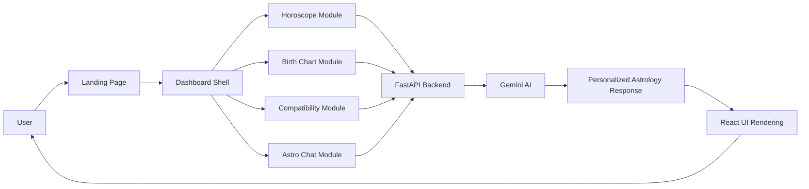

# 🔮 AstroMate — AI-Powered Astrology Experience

## Problem Statement

Modern astrology experiences are often fragmented, static, and difficult to personalize. Users usually get generic zodiac readings, text-heavy outputs, or disconnected tools that do not feel intelligent or intuitive. The core problem is that astrology is highly personal, but most applications still deliver one-size-fits-all content without combining emotional clarity, relationship insights, and AI-guided interpretation into a unified experience.

AstroMate was built to solve this by creating a polished, engaging, AI-first astrology platform that turns abstract cosmic concepts into practical, understandable, and personalized guidance.

---

## Why AstroMate Exists

AstroMate combines:
- personalized user input
- AI-generated astrological interpretation
- responsive user experience
- a clean dashboard workflow
- relationship and life guidance in one system

Instead of treating astrology as entertainment only, the product aims to make it useful for self-understanding, decision support, relationship reflection, and spiritual guidance.

---

## Solution Overview

AstroMate is a full-stack application that blends:

- a modern React frontend for storytelling, UX, and user interactions
- a FastAPI backend for API logic and orchestration
- Google Gemini AI for personalized astrological generation
- a tabbed application workflow for horoscope, birth chart, compatibility, and chat

This gives users a journey from landing page to personalized cosmic insights without losing the sense of wonder and trust that astrology demands.

---

## Architecture at a Glance

### High-Level System Flow

1. The user lands on the AstroMate homepage.
2. They click into the app and navigate to one of the core modules:
   - Daily Horoscope
   - Birth Chart
   - Relationship Match
   - Astro Chat
3. The frontend sends the request payload to the FastAPI backend.
4. The backend validates the request and builds a prompt for Gemini.
5. Gemini generates a personalized astrological response in markdown.
6. The frontend renders the reading cleanly inside the dashboard UI.

### Architecture Components

- Frontend: React + Vite + Tailwind CSS
- Routing: hash-based route switching between landing page and dashboard modules
- API Layer: FastAPI endpoints for each horoscope-related feature
- AI Layer: Gemini API calls with prompt generation and structured output
- Design Layer: cosmic-themed UI, animations, responsive layout, and polished dashboard shell

### Core Lifecycle

The actual flow is straightforward and practical:

- User enters data such as sign, date, birth info, or chat message
- Frontend calls the backend endpoint with structured JSON
- Backend builds a context-aware prompt
- Gemini returns a narrative reading
- Frontend displays the markdown response with styling

This keeps the app modular, easy to extend, and cleanly separated by responsibility.

---

## Tech Stack

### Frontend
- React
- Vite
- Tailwind CSS
- Lucide React
- Framer Motion
- Marked

### Backend
- Python
- FastAPI
- Uvicorn
- Pydantic
- python-dotenv

### AI / Intelligence Layer
- Google Gemini API
- Prompt-based generation for astrology and relationship insight

### Deployment / Hosting Support
- Render configuration included via render.yaml
- frontend environment variable support through VITE_API_URL

---

## Project Structure

```text
AstroMate/
├── backend/
│   ├── main.py
│   ├── requirements.txt
│   └── .env
├── frontend/
│   ├── src/
│   │   ├── App.jsx
│   │   ├── config.js
│   │   ├── main.jsx
│   │   └── components/
│   │       ├── LandingPage.jsx
│   │       ├── Dashboard.jsx
│   │       ├── ZodiacTab.jsx
│   │       ├── BirthChartTab.jsx
│   │       ├── MatchTab.jsx
│   │       ├── ChatTab.jsx
│   │       └── StarField.jsx
│   ├── package.json
│   ├── vite.config.js
│   ├── tailwind.config.js
│   └── index.html
├── README.md
├── render.yaml
└── .gitignore
```

---

## Visual Architecture Diagram



This diagram shows how the product moves from user intent to AI-generated insight and back into a polished interface.

---

## Screenshots

### Landing Page


---

## Functional Workflow

### 1. Landing Experience

The user visits the landing screen first. The landing page presents the product narrative, theme, trust elements, and entry actions. It is designed to create a premium, mystical, high-trust first impression.

### 2. Dashboard Entry
When a user clicks “Enter the Cosmos,” the app navigates to the dashboard shell. This centralized dashboard manages sections for the product’s core features, ensuring a single user flow instead of multiple unrelated pages.

### 3. Horoscope Module
The daily horoscope feature accepts a zodiac sign and date and returns an AI-generated reading covering:
- cosmic energy
- love and relationships
- career and finance
- luck and guidance

### 4. Birth Chart Module
The birth chart view lets the user provide personal details such as:
- name
- date
- time
- birth place

These values are used to craft a simulated natal chart style interpretation and provide insight into:
- Sun sign essence
- Moon sign emotional pattern
- rising sign personality
- planetary placements
- spiritual direction

### 5. Synastry / Match Module
This view compares two individuals through zodiac signs to analyze relationship compatibility, emotional patterns, and general harmony. It produces both a percentage score and narrative guidance.

### 6. Astro Chat Module
Users can ask open-ended astrology questions in a conversational flow. The AI maintains chat context and responds with a mystical but readable tone.

---

## Impact and Utility

AstroMate is more than a visual prototype; it demonstrates how AI, product design, and user experience can converge into a useful wellness and guidance tool.

### Practical Impact
- Gives users personalized daily and life guidance
- Makes astrology accessible to non-experts through clear formatting and friendly UI
- Brings relationship analysis into a practical digital experience
- Creates a reusable architecture for future AI-assisted spiritual or wellness interfaces

### Utility for Real Users
- Daily self-reflection
- Relationship understanding
- Birth-based insight discovery
- Conversational guidance for life questions

### Business / Product Utility
- Strong brand identity
- Easy extension for more modules
- Clear backend/frontend separation
- AI-ready architecture for future experiments and personalization features

---

## How the App Works End-to-End

### Frontend Responsibilities
- Render landing page and dashboard
- Handle routing between sections
- Capture user input
- Send HTTP requests to backend APIs
- Display markdown-formatted responses

### Backend Responsibilities
- Expose REST endpoints
- Validate user input
- Build AI prompts
- Call Google Gemini
- Return structured result payloads

### AI Responsibilities
- Interpret user data contextually
- Produce mystical yet readable readings
- Answer relationship and life questions in a clear tone

---

## API Endpoints

| Method | Endpoint | Purpose |
|---|---|---|
| GET | / | Health check |
| POST | /api/horoscope | Get daily horoscope for a zodiac sign |
| POST | /api/birthchart | Get a detailed birth chart style insight |
| POST | /api/compatibility | Compare two zodiac signs for relationship insight |
| POST | /api/chat | AI chat conversation with astrology context |

---

## Setup and Usage

### Prerequisites
- Python 3.11+
- Node.js 18+
- A valid Google Gemini API key

### 1. Clone the repository

```bash
git clone https://github.com/raj-deep-20/AstroMate-.git
cd AstroMate
```

### 2. Configure the backend environment
Create a .env file inside the backend folder:

```env
GEMINI_API_KEY=your_gemini_api_key_here
PORT=8000
HOST=127.0.0.1
```

If the frontend is deployed separately, configure the frontend environment with the deployed backend URL:

```env
VITE_API_URL=https://your-backend-url.example.com
```

Important: do not add a trailing slash to the URL.

### 3. Install dependencies

#### Backend
```bash
cd backend
pip install -r requirements.txt
```

#### Frontend
```bash
cd frontend
npm install
```

### 4. Run the app locally

From the project root, start the app with:

```bash
python run.py
```

If the root launcher is unavailable or not present in your environment, run both services manually:

#### Backend
```bash
cd backend
python -m uvicorn main:app --reload --host 127.0.0.1 --port 8000
```

#### Frontend
```bash
cd frontend
npm run dev
```

Then open:
- frontend: http://localhost:5173
- backend docs: http://127.0.0.1:8000/docs

---

## Deployment Notes

The project includes a Render deployment config in render.yaml for the backend.

Example backend Render setup:
- root directory: backend
- build command: pip install -r requirements.txt
- start command: python -m uvicorn main:app --host 0.0.0.0 --port $PORT

The frontend should use VITE_API_URL to target the deployed backend API.

---

## Engineering Learnings

This project is a useful example of several core engineering principles:

### 1. Separate concerns cleanly
The frontend handles UX and state; the backend handles API logic; the AI layer handles content generation. This siloed design makes the system easier to maintain and scale.

### 2. Build product flows before heavy complexity
The app emphasizes a clear user journey: landing page → dashboard → feature module → AI-generated result. This is a strong pattern for consumer-facing AI apps.

### 3. Treat AI output as part of the product experience
Astrology is not just data; it is narrative, emotion, and trust. The frontend presentation and markdown styling are critical to whether the output feels helpful and polished.

### 4. Keep integration simple and robust
The API design is intentionally direct and easy to debug. Requests remain lightweight and structured, which helps in testing and extending the app.

### 5. Make the UX feel premium
The visual language, animations, and cosmic aesthetic are not ornamental; they support trust and engagement. In AI product experiences, presentation is a core part of usefulness.

---

## Suggested Next Improvements

- add real astrologic calculation logic beyond prompt-based generation
- integrate a database for saved readings and user history
- add authentication and personalized profiles
- improve prompt engineering for more consistent astrology accuracy
- add tests for API routes and frontend interaction flows
- expand to mobile-first and accessibility improvements

---

## License

This project is open for learning, extension, and personal use. Please ensure you respect the licensing terms of any third-party models or services you integrate.

---

## Summary

AstroMate is a practical demonstration of how AI can be used to turn a mystical domain into a polished digital product. It combines astrology, personalization, and modern engineering to create an experience that is both useful and memorable.

It solves the problem of generic astrology tools by building a more intelligent, accessible, and modern user experience grounded in real AI workflow principles.
